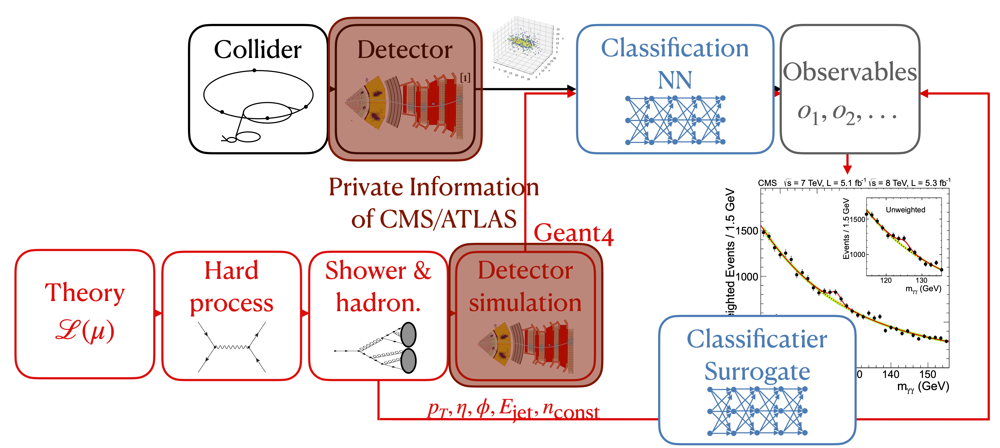

# Classification Surrogates

[Classifier Surrogates](https://arxiv.org/abs/2402.15558) are generative deep learning models trained to estimate the classification results from a neural network using unaccessible detector-level information from accessible high-level jet observables (Reconstruction-level), parton- or particle-level inforamtion. To this end a surrogate needs to
  * reproduce the classification correctly,
  * include uncertainty introduced through the stochasticity of the detector simulation,
  * and indicate sparse regions of training data, as well as unknown imputs through large uncertainties.

We thus choose a continuous normalizing flow trained with conditional flow matching (CFM) as a baseline model and augemnt it with Bayesian inference of the network parameters, either using [Bayes-by-Backprob](https://arxiv.org/abs/1505.05424) (Variational Inference Bayes) or [AdamMCMC](https://arxiv.org/abs/2312.14027).



## Structure

The <code>models/</code> directory contains all necessary definitions for definition of a conditional CFM model. 
  * <code>models/cond_CFM.py</code> defines our a simple CFM model modded to handle conditional generation (see also https://gist.github.com/francois-rozet/fd6a820e052157f8ac6e2aa39e16c1aa). Be aware that the noation of t = 0 being noise and t = 1 being noiseless data is switched in line with the common standard in score-based modeling.
  * <code>models/custem_linear_flipout.py</code> defines a wrapper around the LinearFlipout Layer from https://github.com/IntelLabs/bayesian-torch to surpress sampling of the weights at every call during ODE solving.
  * <code>models/MCMC_Adam.py</code> contains the code for MCMC sampling the network weights. For more Detail we refer to https://github.com/sbieringer/AdamMCMC.
  * <code>jet_dataset.py</code> defines the wrapper used for data handling.

## Basic Usage

First, download the processed JetClass dataset from [here](https://syncandshare.desy.de/index.php/s/5M56tM5KYAjq95o). For more information on the data take a look at Joschka's [repository](https://github.com/joschkabirk/jetclass-top-qcd)

For Training of a (Variational Inference Bayes-) CFM run <code>cond_flow_matching.py</code>. To subsequnetly sample weights starting at the point estimate using AdamMCMC, we provide <code>cond_flow_matching_AdamMCMC.py</code>. 

<code>evalution.ipynb</code> and <code>plotting.ipynb</code> can be used to generate the plots of the paper.

## Citation

For more details see our publication ["Classifier Surrogates: Sharing AI-based Searches with the World"](https://arxiv.org/abs/2402.15558)

```bibtex
@article{Bieringer_2024_surrogates,
    author = "Bieringer, Sebastian and Kasieczka, Gregor and Kieseler, Jan and Trabs, Mathias",
    title = "{Classifier surrogates: sharing AI-based searches with the world}",
    eprint = "2402.15558",
    archivePrefix = "arXiv",
    primaryClass = "hep-ph",
    doi = "10.1140/epjc/s10052-024-13353-w",
    journal = "Eur. Phys. J. C",
    volume = "84",
    number = "9",
    pages = "972",
    year = "2024",
    keywords = {bieringer}
}
```